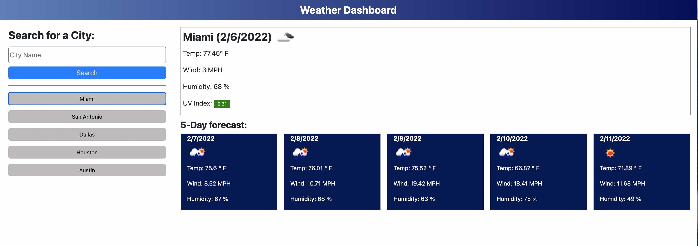

# Weather Dashboard

In this project, I wrote HTML, CSS and JavaScript code to obtain current weather and a 5-day weather forecast for a user-inputted city name.  The information was obtained using two server-side APIs, the first to obtain the geocode for the city, then a second to obtain the weather data using the geocode.  I used custom CSS and some bootstraps for styling.  I used the moment.js library to format and manipulate the dates.  Finally, the search history was saved in local storage and was displayed as buttons to make repeated-searching easier.  

## Deployment

The Weather Dashboard has been deloyed and can be accessed here: 
<a href="https://greenmanaustin.github.io/weather-dashboard/#weather-dashboard" target="_blank">https://greenmanaustin.github.io/weather-dashboard/#weather-dashboard</a>

The following image shows the web application's appearance and functionality:

## Skills Learned

I learned to utilize server-side APIs, bootstrap, and to tinker with styling to achieve a very similar look to the client mockup.  

